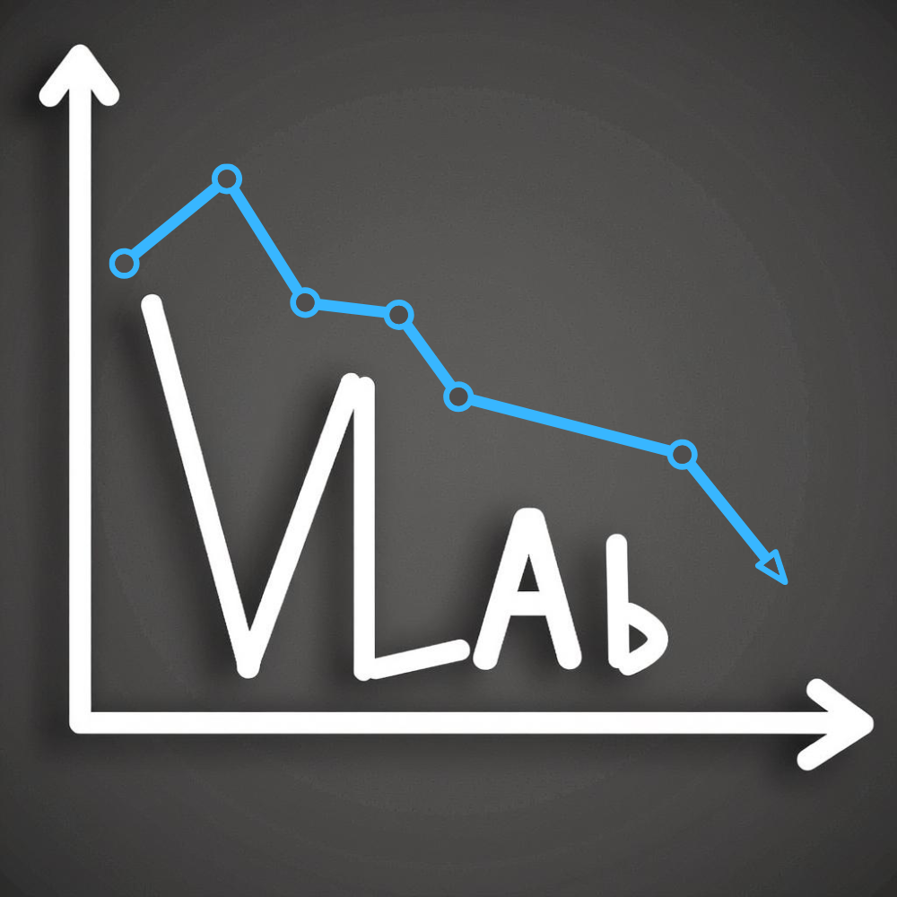

<div align="center">



# VLAb: Your Laboratory for Pretraining VLAs 

<p align="center">
     
</p>

A streamlined library for pretraining vision-language-action (VLA) models on robotics datasets. Derived from [LeRobot](https://github.com/huggingface/lerobot), this library focuses specifically on efficient pretraining workflows across multi-GPU setups and SLURM clusters and can be considered as an official reproduction kit for [SmolVLA](https://huggingface.co/blog/smolvla).

</div>

## Overview

**VLAb** is designed for researchers who want to pretrain VLA models on HuggingFace datasets efficiently. It provides:

- **Pretraining-Focused Architecture**: It includes built-in architecture and data-processing logic to let you iterate quickly on real-world datasets without environment setup overhead.
- **SmolVLA Reproduction**: Official reproduction kit for SmolVLA pretraining—includes almost exact datasets, configurations, and workflows used to train the original model
- **Simple Setup with Reduced Dependencies**: Single-command environment creation with `conda env create -f environment.yml`
- **Distributed Training**: Multi-GPU and multi-node support via Accelerate, tested on single machines and SLURM clusters
- **Multi-Dataset Support**: Train on multiple datasets simultaneously with configurable sampling strategies

> **Important**: This library is optimized for pretraining. For fine-tuning and inference, we recommend using LeRobot with the latest updates. See the [Migration to LeRobot](#migration-to-lerobot) section for checkpoint compatibility.

---

## Table of Contents

- [Installation](#installation)
- [Quick Start](#quick-start)
- [Reproducing SmolVLA Training](#reproducing-smolvla-training)
  - [Downloading Datasets](#downloading-datasets)
  - [Local Training with Accelerate](#local-training-with-accelerate)
  - [SLURM Cluster Training](#slurm-cluster-training)
- [Video Backend Configuration](#video-backend-configuration)
- [Migration to LeRobot](#migration-to-lerobot)
- [Troubleshooting](#troubleshooting)
- [Additional Resources](#additional-resources)
- [Citation](#citation)
- [License](#license)
- [Project Structure](#project-structure)

---

## Installation

### Step 1: Create Environment

```bash
conda env create -f environment.yml
conda activate vlab
```

Alternatively, create the pinned CUDA 12.8 environment with the bundled setup script:

```bash
bash scripts/setup_vlab_env.sh
conda activate vlab
```

The script uses the Tsinghua Conda/PyPI mirrors and installs PyTorch 2.7.1 CUDA
12.8 wheels. Override `ENV_NAME`, `CONDA_CHANNEL`, `PYPI_INDEX_URL`,
`PYTORCH_INDEX_URL`, or `PIP_TIMEOUT` as environment variables when needed.

### Step 2: Set Python Path (IMPORTANT)

```bash
export PYTHONPATH="${PWD}/src:${PYTHONPATH}"
```

For persistence, add to your shell config:

```bash
echo 'export PYTHONPATH="${PWD}/src:${PYTHONPATH}"' >> ~/.bashrc
source ~/.bashrc
```

### Step 3: Verify Installation

```bash
python tests/test_installation.py
```

Expected output:
```
============================================================
VLAb Installation Test
============================================================
✓ TrainPipelineConfig
✓ Policy factory
✓ Dataset factory
============================================================
✅ All tests passed!
```

### Step 4: Configure HuggingFace (Optional)

Only needed if downloading datasets or models from the Hub:

```bash
huggingface-cli login
```

## Quick Start

Train SmolVLA2 on 2 datasets with a single GPU:

```bash
accelerate launch --config_file accelerate_configs/single_gpu.yaml \
    src/lerobot/scripts/train.py \
    --policy.type=smolvla2 \
    --policy.repo_id=HuggingFaceTB/SmolVLM2-500M-Video-Instruct \
    --dataset.repo_id="Beegbrain/pick_lemon_and_drop_in_bowl,Chojins/chess_game_000_white_red" \
    --dataset.video_backend=pyav \
    --output_dir="./outputs/training" \
    --batch_size=8 \
    --steps=10000 \
    --wandb.enable=true \
    --wandb.project="smolvla2-quickstart"
```

**Note:** `--policy.repo_id` specifies the base vision-language model (SmolVLM) to use. The trained model will be saved to `--output_dir`.

This will:
1. Download the specified 2 datasets from HuggingFace Hub
2. Train SmolVLA2 on a single GPU for 10,000 steps
3. Save checkpoints to `./outputs/training`
4. Log metrics to Weights & Biases

## TeleAvatar V2 Training

TeleAvatar V2 datasets produced by `rosbag_to_dataset_TA2` contain 72-dimensional
state/action vectors and three side-by-side stereo videos. VLAb adapts them to
the SmolVLA contract at load time:

- state: 14 absolute arm joint positions (`[0:7, 8:15]`)
- action: 14 absolute arm targets plus gripper efforts at source indices 39 and 47
- grippers: source effort is converted to the platform's continuous `[0, 1]`
  trigger space
- cameras: head, left wrist, and right wrist all use the left stereo eye,
  cropped from the side-by-side stereo videos and then downscaled 2x to the
  resolution the robot's RTP feed delivers at deployment (head 960x960,
  wrists 400x640), so training and deployment start the policy's own 512x512
  resize from the same source resolution
- camera order: head, left wrist, right wrist

The gripper transform is piecewise, so raw LeRobot statistics cannot be sliced
or reused. Compute adapted statistics once before training (the source dataset is
not modified):

```bash
python scripts/compute_teleavatar_v2_stats.py \
    --dataset /path/to/datasets/teleavatar_v2/my_task
```

This writes
`/path/to/datasets/teleavatar_v2/my_task/meta/teleavatar_v2_stats.json`.
Loading a `robot_type: teleavatar` dataset without this file fails explicitly.

State/action statistics are computed on the real 14/16 dimensions before model
padding. Training pads action vectors to 32 dimensions internally, but the loss
uses only the first 16 real dimensions and masks episode-boundary timesteps.

Then train using the dataset path relative to `--dataset.root`:

```bash
accelerate launch --config_file accelerate_configs/single_gpu.yaml \
    src/lerobot/scripts/train.py \
    --policy.type=smolvla2 \
    --policy.repo_id=HuggingFaceTB/SmolVLM2-500M-Video-Instruct \
    --dataset.repo_id=teleavatar_v2/my_task \
    --dataset.root=/path/to/datasets \
    --dataset.video_backend=pyav \
    --output_dir=./outputs/teleavatar_v2 \
    --batch_size=8 \
    --steps=10000
```

Before a long run, verify one loaded batch has state shape `[B, 14]`, action
shape `[B, horizon, 16]`, and the three canonical image keys
`observation.images.image`, `image2`, and `image3`. Deployment must use the same
all-left-eye camera convention.

### Fine-tuning from a pretrained SmolVLA checkpoint

Use `--policy.type=smolvla2` to initialize a new policy from the SmolVLM
backbone. Use the existing `--policy.path` interface instead when starting a
new fine-tuning run from a complete SmolVLA checkpoint:

```bash
accelerate launch --config_file accelerate_configs/single_gpu.yaml \
    src/lerobot/scripts/train.py \
    --policy.path=lerobot/smolvla_robotwin \
    --policy.load_vlm_weights=false \
    --policy.train_expert_only=true \
    --policy.freeze_vision_encoder=true \
    --dataset.repo_id=teleavatar_v2/my_task \
    --dataset.root=/path/to/datasets \
    --dataset.video_backend=pyav \
    --output_dir=./outputs/teleavatar_v2_finetune \
    --batch_size=8 \
    --steps=80000
```

`lerobot/smolvla_base`, `lerobot/smolvla_robotwin`, a compatible local
checkpoint directory, and checkpoints produced by this repository all use the
same path. Do not pass `--policy.type` together with `--policy.path`.
Fine-tuning starts a new optimizer and learning-rate schedule; use
`--resume=true` with a saved `train_config.json` only when restoring an
interrupted run.

The SLURM launchers expose this existing CLI path as the `POLICY_PATH`
environment variable:

```bash
POLICY_PATH=lerobot/smolvla_robotwin \
TRAIN_EXPERT_ONLY=true \
FREEZE_VISION_ENCODER=true \
sbatch scripts/train_floor2_slurm.sh
```

Checkpoint loading is fail-closed: every non-normalization tensor must exist
and match the instantiated model shape. Normalization buffers are intentionally
replaced with statistics from the target dataset.


## Reproducing SmolVLA Training

If you want to use VLAb with the SmolVLA pretraining datasets and reproduce SmolVLA results, use the following community datasets:

### SmolVLA Community Datasets

- **[Community Dataset v1](https://huggingface.co/datasets/HuggingFaceVLA/community_dataset_v1)**: 128 datasets from 55 contributors (11.1K episodes, 5.1M frames, 46.9 hours, 119.3 GB) — the curated subset used to pretrain SmolVLA with quality filtering and manual task description curation
- **[Community Dataset v2](https://huggingface.co/datasets/HuggingFaceVLA/community_dataset_v2)**: 340 datasets from 117 contributors (6.3K episodes, 5M frames, 46.6 hours, 59 GB) with LeRobot v2.0/v2.1 format support

Both datasets feature SO-100 robotic arm demonstrations focused on tabletop manipulation tasks, pick-and-place operations, and everyday object interactions. Community Dataset v1 represents a curated, high-quality subset with manually verified task descriptions, while v2 expands the collection with more contributors and datasets.

**Dataset Structure**: Both datasets use a hierarchical structure with contributor subdirectories:
```
community_dataset_v1/v2/        
├── contributor1/               
│   ├── dataset_name_1/    
│   │   ├── data/                 
│   │   ├── videos/             
│   │   └── meta/                 
│   └── dataset_name_2/           
├── contributor2/                  
│   └── dataset_name_3/           
└── ...                            
```

### Downloading Datasets

Note that the downloading may take some time (3/4 hours), especially for the first dataset

```bash
# Download Community Dataset v1 (128 datasets, 11.1K episodes, 119.3 GB)
hf download HuggingFaceVLA/community_dataset_v1 \
       --repo-type=dataset \
       --local-dir /path/local_dir/community_dataset_v1

# Download Community Dataset v2 (340 datasets, 6.3K episodes, 59 GB)
hf download HuggingFaceVLA/community_dataset_v2 \
       --repo-type=dataset \
       --local-dir /path/local_dir/community_dataset_v2
```

### Local Training with Accelerate

VLAb uses Accelerate for distributed training. Choose between provided configs or create your own:

```bash
# Configure your own (one-time setup)
accelerate config

# Or use provided configs
accelerate launch --config_file accelerate_configs/single_gpu.yaml ...
accelerate launch --config_file accelerate_configs/multi_gpu.yaml ...
```

#### Training from Local Datasets

If you've pre-downloaded datasets, specify the root directory:

```bash
# Train on locally downloaded datasets
accelerate launch --config_file accelerate_configs/multi_gpu.yaml \
    src/lerobot/scripts/train.py \
    --policy.type=smolvla2 \
    --policy.repo_id=HuggingFaceTB/SmolVLM2-500M-Video-Instruct \
    --dataset.repo_id="community_dataset_v2/airthebear/so100_GL,community_dataset_v2/acrampette/third_arm_01" \
    --dataset.root="/path/to/datasets" \
    --dataset.video_backend=pyav \
    --dataset.features_version=2 \
    --output_dir="./outputs/training" \
    --batch_size=8 \
    --steps=200000 \
    --wandb.enable=true \
    --wandb.project="smolvla2-training"
```

**Important**: When using `--dataset.root`, the `--dataset.repo_id` paths should be relative to the root directory. For example:
- Root: `/path/to/datasets`
- Repo ID: `community_dataset_v1/user/dataset_name`
- Dataset location: `/path/to/datasets/community_dataset_v1/user/dataset_name`

### SLURM Cluster Training

For distributed training on SLURM clusters, we provide example scripts:

- **`examples/scripts/train_smolvla_optimized_fresh.slurm`**: Start training from scratch
- **`examples/scripts/train_smolvla_resume.slurm`**: Resume from checkpoint

**Usage:**

1. Edit the script to match your cluster configuration (partitions, nodes, GPUs, etc.)
2. Submit the job:

```bash
sbatch examples/scripts/reproduce_smolvla.slurm
```

For detailed documentation on SLURM scripts, dataset configuration, and advanced options, see the [Examples README](examples/README.md).

## Migration to LeRobot

Checkpoints from VLAb may not be directly compatible with the latest LeRobot version due to updated normalization formats. To use your pretrained models with LeRobot:

1. **Convert Checkpoint**: Use the [migration script](https://github.com/huggingface/lerobot/blob/f6b16f6d97155e3ce34ab2a1ec145e9413588197/src/lerobot/processor/migrate_policy_normalization.py#L4) from LeRobot
2. **Fine-tune**: Follow the [LeRobot fine-tuning guide](https://huggingface.co/docs/lerobot/smolvla)
3. **Inference**: Use LeRobot's updated inference pipeline

## Troubleshooting

### Cache Issues

If you encounter corrupted files, outdated metadata, or persistent errors:

**Manual Cache Cleanup**
```bash
rm -rf ~/.cache/huggingface/datasets
rm -rf ~/.cache/huggingface/hub
rm -rf ~/.cache/huggingface/transformers
```

**Automatic Cleanup in SLURM**

In SLURM scripts, set `CLEAN_CACHE=true` to automatically clean cache before training.

> **Note**: After cleaning cache, datasets will be re-downloaded on first use.

For additional help, open an issue on [GitHub](https://github.com/huggingface/vlab/issues).

## Additional Resources

- **[LeRobot GitHub](https://github.com/huggingface/lerobot)**: Main LeRobot repository for fine-tuning and inference
- **[SmolVLA Fine-tuning Guide](https://huggingface.co/docs/lerobot/smolvla)**: Complete guide for fine-tuning with LeRobot
- **[LeRobot Installation](https://huggingface.co/docs/lerobot/en/installation)**: Detailed installation instructions
- **[Accelerate Documentation](https://huggingface.co/docs/accelerate)**: Distributed training configuration

## Citation

If you use this library in your research, please cite:

```bibtex
@misc{aubakirova2025vlab,
  author = {Dana Aubakirova, Mustafa Shukor and Jade Cholgari and Leandro von Werra},
  title = {VLAb: Your Laboratory for Pretraining VLAs},
  year = {2025},
  publisher = {GitHub},
  journal = {GitHub repository},
  howpublished = {\url{https://github.com/huggingface/vlab}}
}
```

And the SmolVLA paper:

```bibtex
@article{shukor2025smolvla,
  title   = {SmolVLA: A vision-language-action model for affordable and efficient robotics},
  author  = {Shukor, Mustafa and Aubakirova, Dana and Capuano, Francesco and Kooijmans, Pepijn and Palma, Steven and Zouitine, Adil and Aractingi, Michel and Pascal, Caroline and Russi, Martino and Marafioti, Andres and Alibert, Simon and Cord, Matthieu and Wolf, Thomas and Cadene, Remi},
  year    = {2025},
  journal = {arXiv preprint},
  eprint  = {2506.01844},
  archivePrefix = {arXiv},
  primaryClass  = {cs.RO}
}
```

## License

This project is licensed under the Apache License 2.0. See the [LICENSE](LICENSE) file for details.

## Project Structure

```
VLAb/
├── src/lerobot/                  # Core library code
│   ├── configs/                  # Configuration classes
│   ├── datasets/                 # Dataset loading and processing
│   ├── optim/                    # Optimizers and schedulers
│   ├── policies/                 # Policy implementations
│   │   └── smolvla2/            # SmolVLA2 architecture
│   ├── scripts/                  # Training scripts
│   └── utils/                    # Utility functions
├── examples/                      # Example scripts and notebooks
│   ├── scripts/                   # SLURM training scripts
│   └── all_datasets_relative.txt  # Pretraining dataset list
├── tests/                         # Test scripts
│   └── test_installation.py       # Installation verification script
├── accelerate_configs/            # Accelerate configuration files
├── environment.yml                # Conda environment specification
└── README.md                     # This file
```
